# LAN File Transfer 设计与架构说明

本文记录 `v0.2.0` 版本已经完成的产品能力、代码架构、数据模型、计数统计模型和核心运行流程。

它偏向“当前实现说明”，不是路线图，也不是开发日志。后续维护时可以先读本文，再去看具体源码。

## 1. 当前完成范围

`v0.2.0` 已经从命令行实验工具演进成一个可安装的局域网传输产品。当前完成内容包括：

- Qt GUI 主程序 `lan-gui`
- 命令行工具 `sender`、`receiver`、`local-copy`
- TCP 文件和目录传输
- UDP 局域网发现
- 连接验证码确认
- 多设备连接和发送目标选择
- 全局并发和单设备并发控制
- 超出并发限制后的任务排队
- 每个设备独立的传输任务视图
- 接收历史记录
- 托盘运行和关闭动作设置
- 拖拽发送文件和文件夹
- 粘贴剪贴板文件、文件夹和截图图片
- 截图图片接收后自动写入对端剪贴板
- Debug 日志窗口
- 中文翻译
- desktop 文件
- SVG 图标
- Debian deb 打包
- GitHub Release 发布流程
- `CHANGELOG.md` 发布记录

## 2. 产品形态

GUI 的目标不是做成复杂的文件管理器，而是围绕一个高频动作：

> 发现设备，确认连接，把文件拖进去或粘贴进去，然后让对端收到。

当前页面结构如下：

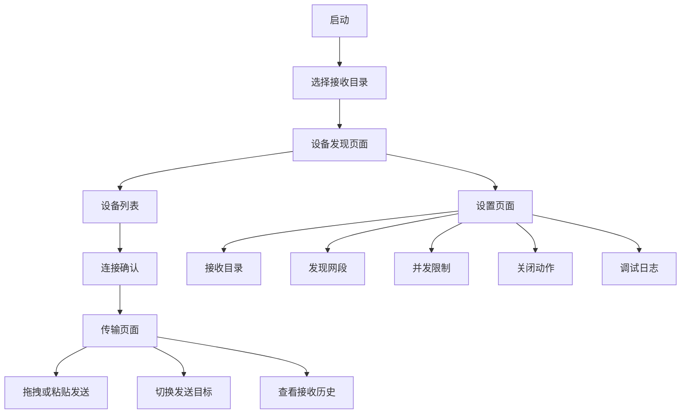

页面职责：

- 接收目录页只负责选择本机保存路径。
- 设备发现页负责搜索、连接、断开、显示全局已连接数量。
- 传输页只显示当前设备名和该设备相关任务。
- 设置页负责影响全局行为的参数。
- Debug 日志从传输页移出，避免干扰传输列表。

## 3. 总体架构

项目按层拆分，核心传输能力不依赖 GUI。GUI 只做交互、状态展示和任务调度接入。

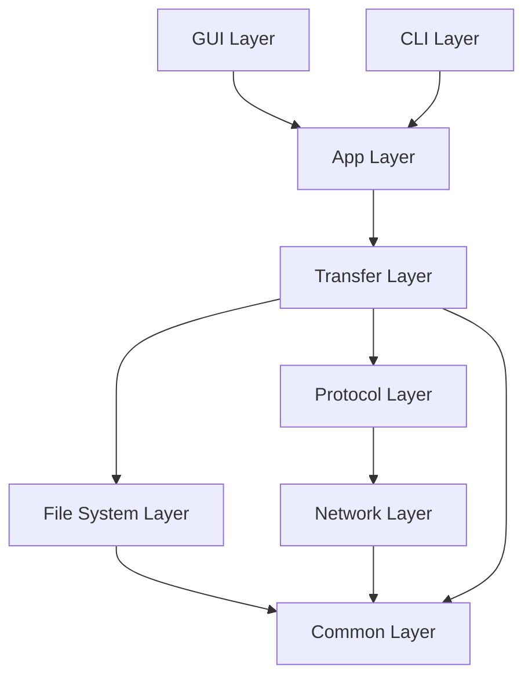

主要原则：

- 传输逻辑和 GUI 解耦。
- 网络使用 `NetworkBackend` 抽象，当前实现是 POSIX socket。
- 文件落盘使用 `.part` 临时文件，完成后再 rename。
- 错误用 `Result<T>` 和结构化 `Error` 传递。
- 进度用事件和快照传播到 GUI。
- 多设备发送通过 `TransferScheduler` 统一排队和并发控制。

## 4. 源码模块边界

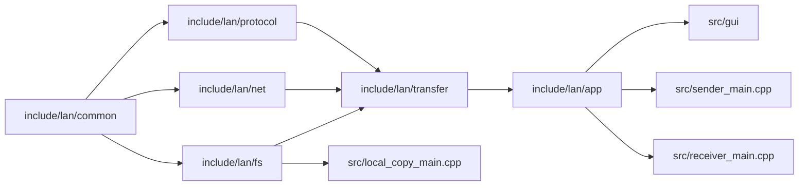

### 4.1 common

`common` 提供项目共同语言：

- `Result<T>`：函数成功返回值，失败返回错误。
- `Error`：错误码、类别、是否可重试、是否需要用户处理。
- `CancellationToken`：取消长时间任务。
- `Stopwatch`：统计耗时。
- size/path 工具：统一显示文件大小、速率和路径校验。

### 4.2 fs

`fs` 负责本地文件系统能力：

- RAII 文件描述符。
- SHA256 文件校验。
- 本地复制。
- `.part` 文件保护。
- rename 提交。

### 4.3 net

`net` 提供网络抽象：

- `Connection`：读写字节流。
- `Listener`：监听和接收连接。
- `NetworkBackend`：创建连接或监听器。
- `posix_backend`：当前 Linux POSIX socket 实现。

### 4.4 protocol

`protocol` 负责消息边界和握手：

- frame header。
- message type。
- hello 编解码。
- ack 和 error frame。

### 4.5 transfer

`transfer` 是核心业务层：

- 单文件传输。
- 文件元数据。
- chunk 编解码。
- 目录 manifest。
- sync plan。
- full 文件流式发送。
- delta 流式发送。
- 接收端 delta 应用。

### 4.6 app

`app` 是命令行和 GUI 共用的应用编排层：

- 解析 sender/receiver 配置。
- 启动 sender transfer。
- 启动 receiver server。
- 把传输过程转换成事件。
- 把事件汇总成快照。
- 调度多设备发送队列。

### 4.7 gui

`gui` 负责用户界面：

- `MainWindow`：页面组织、交互入口、状态刷新。
- `DeviceManager`：设备集合、在线状态、连接状态、活动设备、发送目标。
- `DiscoveryController`：UDP discovery socket 和控制消息。
- `TransferListModel`：任务快照、任务所属设备、按设备过滤。
- `TransferCard`：单个任务展示。
- `DropPanel`：拖拽区域。
- `SettingsDialog`：接收目录、发现网段、并发限制、关闭动作、日志入口。
- `ReceiveHistoryDialog`：接收历史。
- `target_dialogs`：发送目标选择和任务目标切换。

## 5. GUI 运行状态模型

GUI 的关键状态可以分成四类：

- 本机状态：接收目录、receiver 是否启动、托盘状态。
- 设备状态：发现设备、在线状态、连接状态、活动设备。
- 发送目标状态：当前发送给哪些已连接设备。
- 任务状态：每个设备各自的任务列表和任务生命周期。

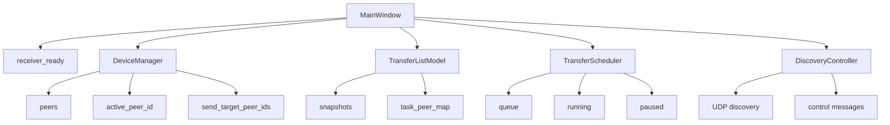

### 5.1 设备状态

`DeviceManager` 维护设备列表。

一个设备主要有这些状态：

- `id`：设备稳定 ID。
- `name`：设备名。
- `host`：IP 地址。
- `port`：TCP 接收端口。
- `online`：最近发现是否在线。
- `linked`：是否已经通过验证码确认连接。
- `last_seen_ms`：最后发现时间。
- `last_linked_ms`：最后连接时间。

设备列表中可能出现 remembered 设备，即以前连接过但当前不在线的设备。这样用户可以知道历史设备，并且设备重新上线时能合并状态。

### 5.2 活动设备和发送目标

这两个概念分开：

- `active_peer_id`：当前传输页面正在看的设备。
- `send_target_peer_ids`：拖拽或粘贴时要发送到的设备集合。

为什么要分开：

- 用户可能连接了多台设备。
- 当前页面只看 A 设备任务。
- 但发送目标可以是 A、B、C 多台设备。
- 每个设备仍然有自己的任务列表，不混在一起。

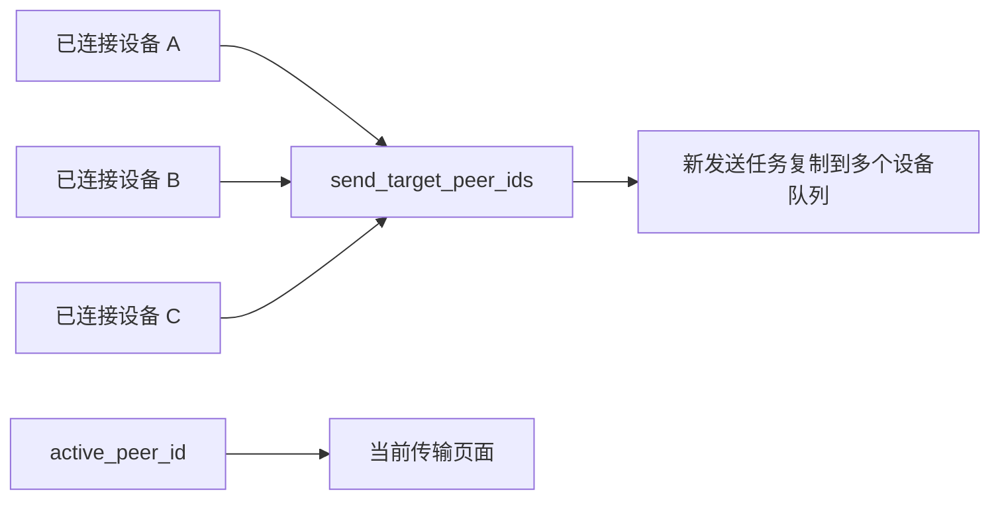

### 5.3 连接数量显示

连接数量不是当前页面数量，而是本机已连接设备总数。

所以它显示在设备发现页右下角，而不是传输页标题中。

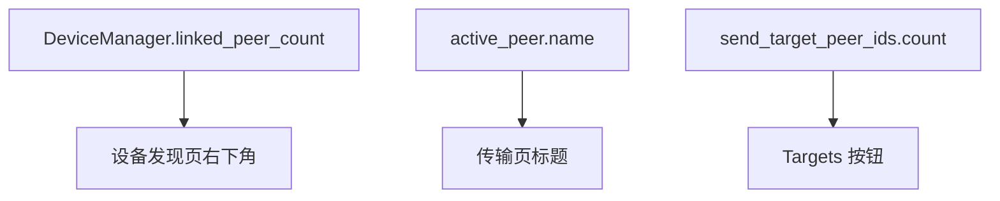

## 6. 任务调度和计数模型

多设备发送的核心是 `TransferScheduler`。

它解决的问题：

- 不让所有任务同时启动。
- 支持全局并发限制。
- 支持单设备并发限制。
- 设备离线时任务等待。
- 用户可以暂停、恢复、取消排队任务。
- 用户可以把排队任务移动到其他已连接设备。

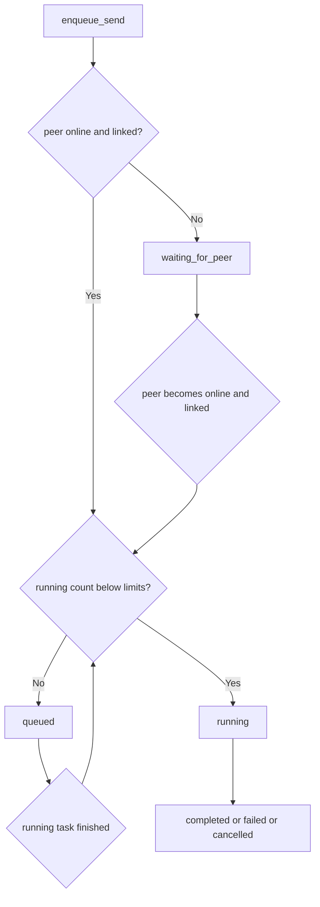

### 6.1 并发计数

调度器用两类计数做启动判断：

- 全局 running 数。
- 当前 peer 的 running 数。

启动条件：

```text
global_running < max_global_sends
peer_running < max_peer_sends
peer.online == true
peer.linked == true
```

计数来源：

- `running_`：当前正在运行的任务。
- `queue_`：排队或等待设备的任务。
- `paused_`：用户暂停的任务。

### 6.2 peer 统计

`SchedulerPeerStats` 用于统计单个设备的任务状态：

- `queued`
- `running`
- `waiting`
- `paused`

这些统计可用于后续增强 UI，例如设备卡片上显示该设备有几个排队任务、几个正在发送任务。

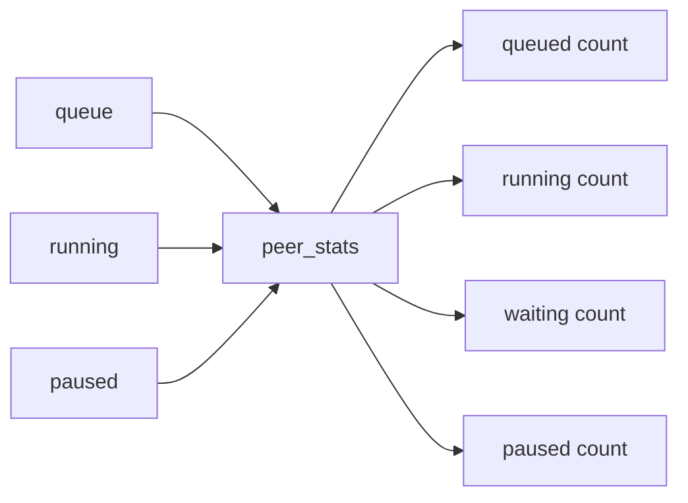

### 6.3 传输进度计数

`TransferSnapshot` 是 GUI 展示任务状态的统一数据结构。

关键字段：

- `current_bytes`
- `total_bytes`
- `processed_files`
- `total_files`
- `skipped_files`
- `full_files`
- `delta_files`
- `payload_bytes`
- `elapsed_seconds`
- `resumed_from`
- `completion_status`
- `error`

速率显示通常由：

```text
current_bytes / elapsed_seconds
```

或传输层上报的 payload 变化推导。

目录传输的进度不是只看字节，还要看文件数量：

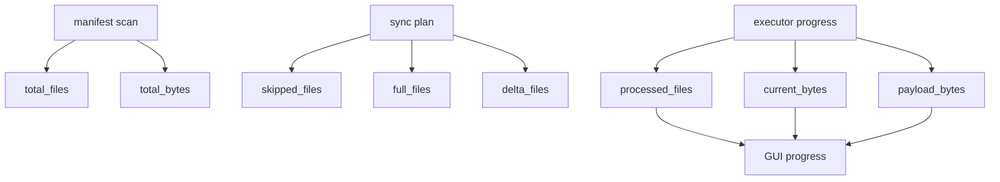

## 7. 启动和接收端流程

GUI 启动后先确保本机接收端运行。只有 receiver 成功启动，其他机器才可以连接和发送。

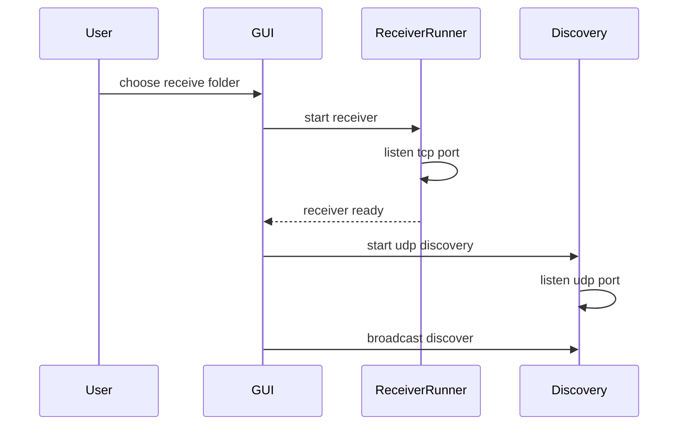

如果 receiver 没启动成功，设备可能能通过 UDP 被发现，但 TCP 发送时会出现连接拒绝。这也是之前真实机器测试时暴露出来的问题，所以后来增加了更详细的日志。

## 8. 设备发现流程

设备发现分为三类：

- 本机网卡广播。
- 用户配置的额外发现网段。
- 用户手动输入 IP。

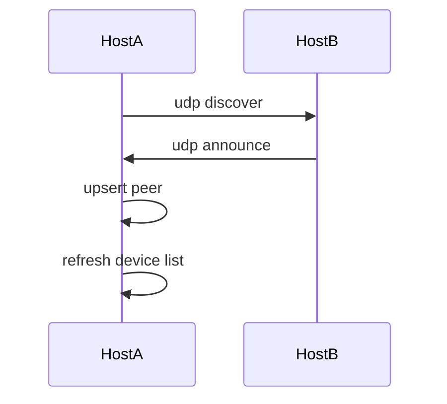

发现消息只负责告诉对方：

- 我是谁。
- 我的设备名是什么。
- 我的 TCP 接收端口是多少。

发现不等于连接，连接仍然需要验证码确认。

## 9. 连接确认流程

连接是双向状态。A 发起连接，B 接受后，两端都要变成 linked。

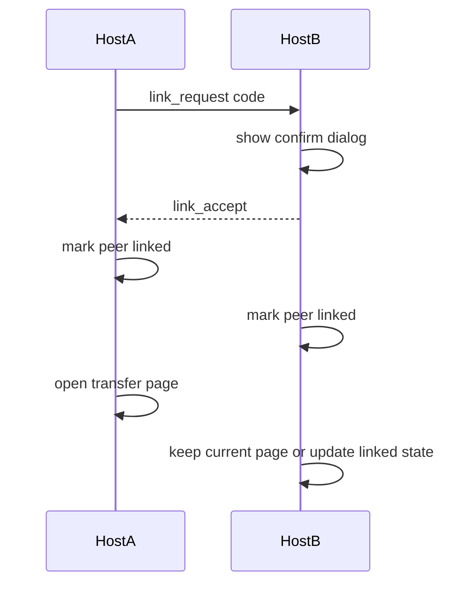

断开连接也要同步：

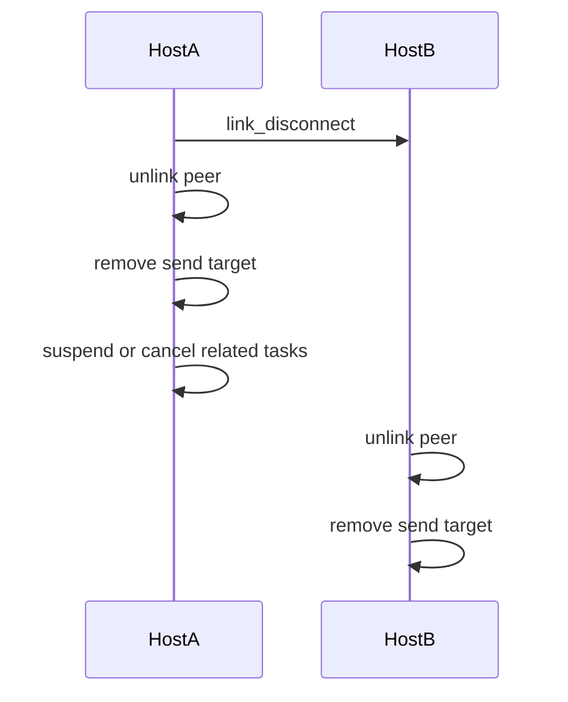

## 10. 拖拽发送流程

用户在传输页拖拽文件或文件夹。GUI 不直接开线程发送，而是把任务提交给 `TransferScheduler`。

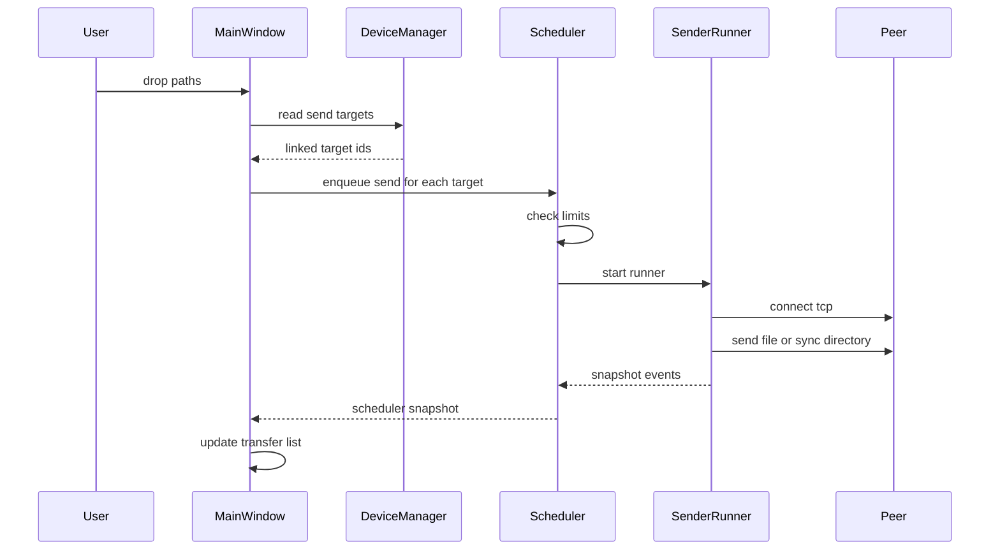

同一个源路径发给多台设备时，会为每台设备创建独立任务。这样每个设备可以独立失败、重试、暂停或排队。

## 11. 单文件传输时序

单文件传输强调完整性和断点续传。

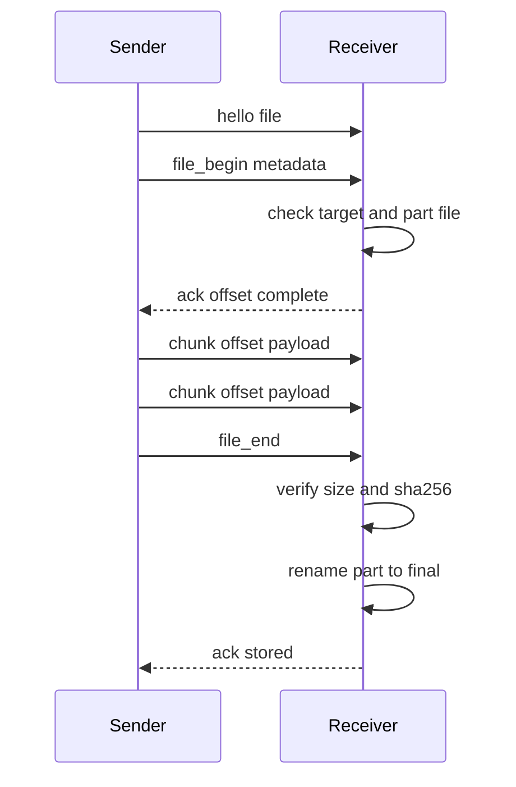

接收端策略：

- 如果目标文件已经存在且 hash 相同，返回 `complete=1`。
- 如果 `.part` 存在且允许续传，返回已接收 offset。
- 如果 `.part` 比源文件还大，重新开始。
- 完成后校验大小和 SHA256。
- 校验成功才 rename。

## 12. 目录同步时序

目录同步用 manifest 和 sync plan 分离“扫描”和“传输”。

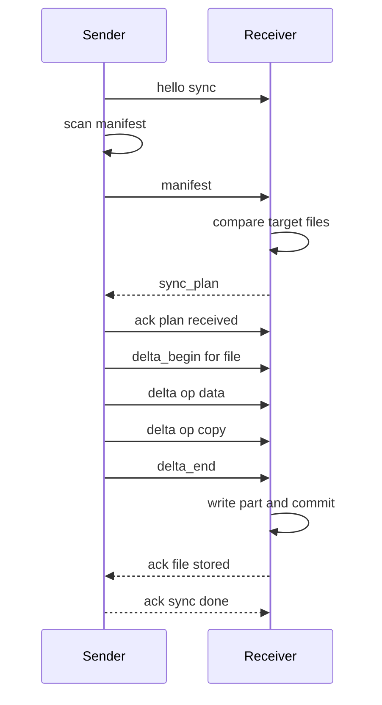

### 12.1 manifest

manifest 记录源目录中每个文件的：

- 相对路径。
- 文件大小。
- mtime。
- mode。

当前为了避免大目录拖进去后长时间卡住，扫描阶段不预计算每个文件的 SHA256。

### 12.2 sync plan

接收端根据本地目标文件生成计划：

- `skip`：大小和 mtime 匹配，跳过。
- `full`：目标缺失或无法作为 basis，需要发送完整文件。
- `delta`：目标存在但可能变化，尝试 delta。

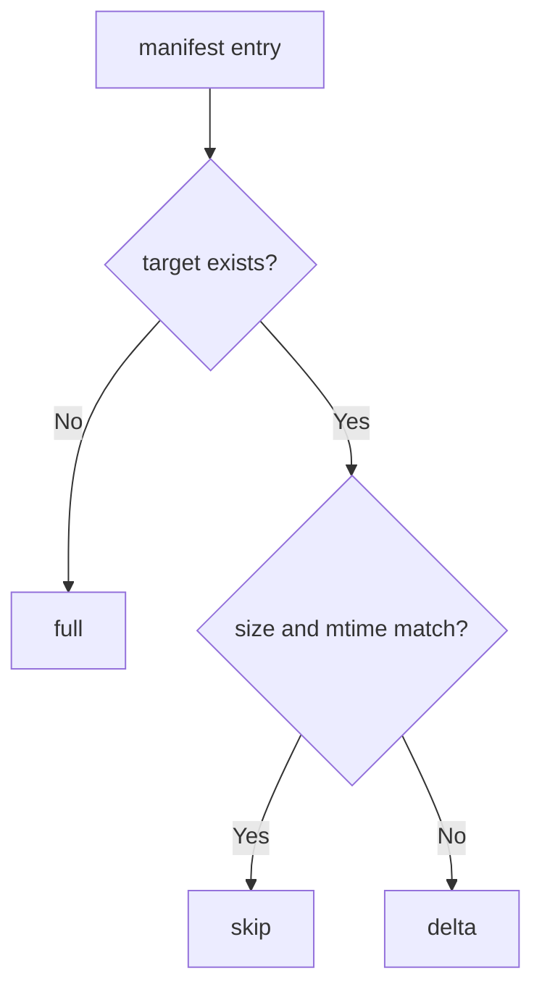

### 12.3 full 和 delta

full 和 delta 都通过 delta stream 发送，差异在于操作类型：

- full 本质上是一串 data 操作。
- delta 会混合 copy 操作和 data 操作。

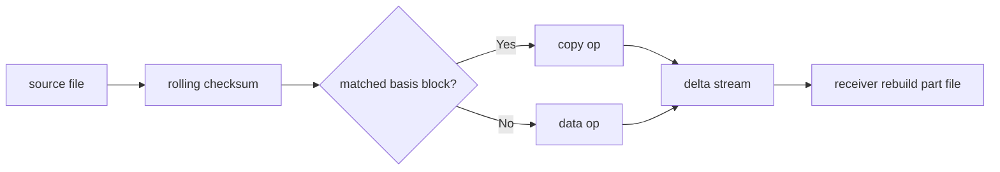

## 13. 剪贴板图片传输流程

剪贴板图片没有原始本地文件路径，所以发送端会先把图片写成临时图片文件，并在协议 metadata 里标记来源。

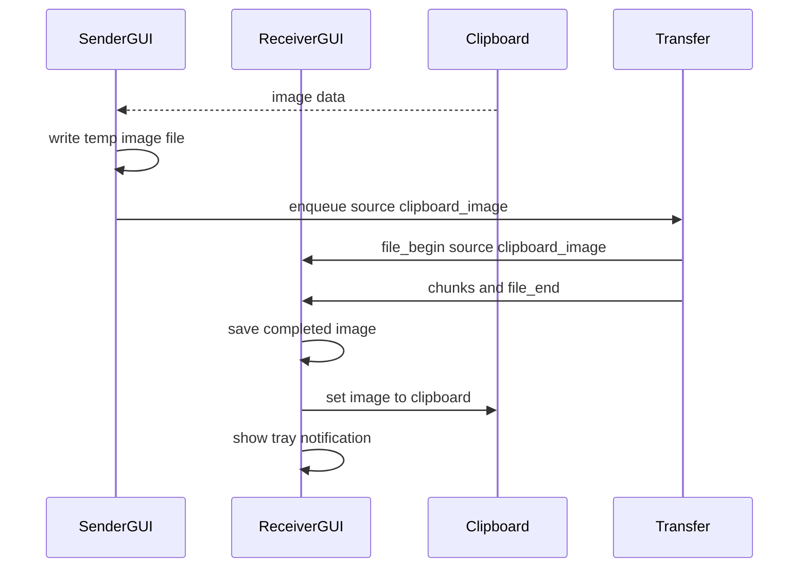

metadata 中关键字段：

```text
source=clipboard_image
```

接收端看到这个来源后，在文件完成时把图片写回剪贴板。这样用户可以在另一台机器上直接粘贴。

## 14. 传输任务生命周期

任务状态由事件驱动，最后变成快照展示。

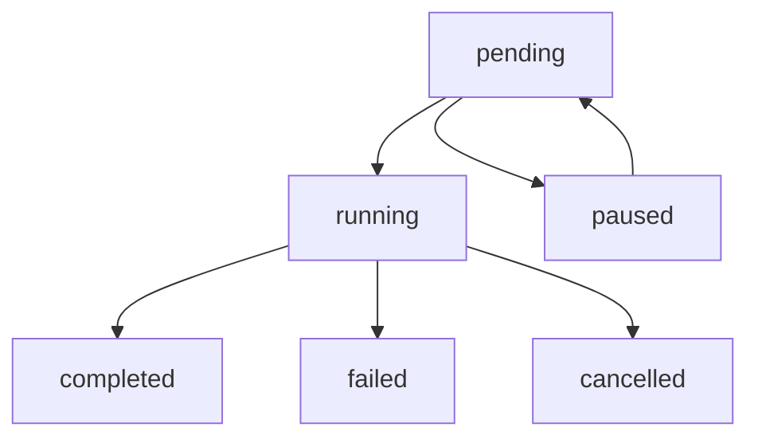

事件到快照的流向：

```mermaid
sequenceDiagram
    participant T as Transfer
    participant E as TransferEvents
    participant S as SnapshotStore
    participant G as GUI

    T->>E: on_transfer_started
    E->>S: apply started
    S-->>G: snapshot pending or running
    T->>E: on_transfer_progress
    E->>S: apply progress
    S-->>G: update card
    T->>E: on_transfer_completed
    E->>S: apply completed
    S-->>G: final card
```

GUI 卡片操作和含义：

- Stop：停止正在运行或可取消的任务。
- Pause：暂停排队任务。
- Resume：恢复暂停或失败后可继续的任务。
- Remove：只移除列表卡片，不代表停止底层任务。
- Open：打开接收完成后的本机目录。

## 15. 接收历史流程

接收历史只记录本机接收完成的任务，方便用户打开保存目录。

```mermaid
sequenceDiagram
    participant R as Receiver
    participant G as GUI
    participant H as History

    R-->>G: receive completed snapshot
    G->>H: record item
    H->>H: save to settings
    G->>H: open history dialog
    H-->>G: selected item
    G->>G: open containing folder
```

## 16. 日志和调试设计

日志分两层：

- GUI 内存日志：用于快速定位用户遇到的问题。
- 终端输出和测试输出：用于开发阶段排查。

GUI 日志窗口现在藏在设置页中，避免传输页常驻日志区域挤压任务列表。

```mermaid
graph TD
    A["Discovery logs"] --> D["log buffer"]
    B["Scheduler logs"] --> D
    C["Transfer logs"] --> D
    D --> E["Settings"]
    E --> F["Debug logs dialog"]
```

## 17. 打包和发布流程

当前发布流程已经自动化到脚本层。

```mermaid
graph TD
    A["update version"] --> B["update CHANGELOG"]
    B --> C["cmake configure"]
    C --> D["build"]
    D --> E["ctest"]
    E --> F["cpack deb"]
    F --> G["check package contents"]
    G --> H["git commit"]
    H --> I["git tag"]
    I --> J["gh release create"]
    J --> K["upload deb"]
```

`scripts/package_deb.sh` 会检查这些关键文件是否进入包：

- `/usr/bin/sender`
- `/usr/bin/receiver`
- `/usr/bin/local-copy`
- `/usr/bin/lan-gui`
- `/usr/share/applications/lan-file-transfer.desktop`
- `/usr/share/icons/hicolor/scalable/apps/lan-file-transfer.svg`
- `/usr/share/lan-file-transfer/translations/lan-file-transfer_zh_CN.qm`
- `/usr/share/doc/lan-file-transfer/CHANGELOG.md`

## 18. 关键设计取舍

### 18.1 为什么不直接用 rsync

项目目标是学习和掌握传输系统的完整链路：

- 网络连接。
- 协议帧。
- 文件落盘。
- 断点续传。
- 目录同步。
- delta。
- GUI 状态管理。
- 打包发布。

所以没有直接调用 `rsync`，而是自己实现一个可演进的简化版本。

### 18.2 为什么连接和发现分开

发现只是“我看到了这台机器”。连接是“我信任并允许和这台机器互发”。

如果发现后直接允许发送，会缺少用户确认和基本权限边界。

### 18.3 为什么 active peer 和 send targets 分开

多设备互联后，一个窗口必须同时支持：

- 看某一台设备的任务。
- 给多台设备发送同一批文件。

所以 UI 当前看的设备不能等同于发送目标集合。

### 18.4 为什么任务调度放到 app 层

任务调度涉及：

- 设备在线状态。
- 并发限制。
- 排队和暂停。
- 取消运行中的发送线程。
- 测试 fake runner。

这些不是纯 UI 逻辑。如果放在 `MainWindow` 里，后续维护会很难，所以拆到 `TransferScheduler`。

### 18.5 为什么设置页用滚动内容区

设置项会继续增加，且中文、英文、不同主题字体宽度都不同。

所以设置页采用：

- 标题固定。
- 内容区可滚动。
- 底部按钮固定。

避免某个控件把保存按钮挤出窗口。

## 19. 当前不足和后续方向

已经完成的是可用版本，不是终点。后续可以继续做：

- 传输加密和设备信任列表。
- 更完整的目录语义，包括空目录、删除、符号链接、权限扩展。
- per-chunk checksum。
- 更详细的任务详情页。
- 任务筛选和批量操作。
- 更强的历史记录搜索。
- 局域网发现的更多网络环境适配。
- CI 自动构建测试。
- GitHub Release 自动上传多架构包。

## 20. Mermaid 兼容说明

本文 Mermaid 图只使用 Mermaid 8.3.0 可渲染的基础语法：

- `graph TD`
- `graph LR`
- `sequenceDiagram`
- ASCII 节点 ID
- 每条边单独一行
- 不使用 `flowchart`
- 不使用复杂 class 样式
- 不使用 Mermaid 新版本专有语法

如果某个 Markdown 渲染器仍然报错，优先检查是否把多条 Mermaid 语句压缩到同一行。
