# 开发过程回溯日志

这不是初始设计文档。

这份文档记录的是 LAN File Transfer 从零到当前版本的真实开发推进过程：我们先做了什么，为什么下一步要做那个，中间遇到了什么问题，怎么定位，最后怎么解决。

阅读它的目标是：以后继续开发时，可以知道“这个设计为什么会变成现在这样”，而不是只看到最后的代码形态。

## 0. 最初目标

一开始的目标很简单：

> 做一个 C++ 局域网文件传输工具，不直接调用 `scp`/`rsync`，而是自己实现传输协议、文件处理、目录同步、GUI 和打包。

这个目标后面逐步拆成几条线：

- 先能复制文件。
- 再能通过 TCP 发文件。
- 再能可靠地传：校验、断点续传、错误处理。
- 再能传文件夹。
- 再优化文件夹传输：跳过相同文件、delta、流式处理。
- 再把 CLI 能力包装成 GUI。
- 最后根据真实机器测试修体验和稳定性问题。

整体推进过程如下：

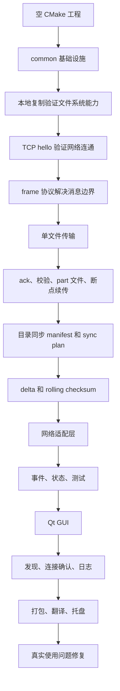

## 1. 从空工程到 common/app 分层

### 当时状态

最开始只有一个 CMake 工程，sender 和 receiver 也只是可执行目标，还没有真正业务。

我们先讨论了目录分层：

- `common`：通用工具，不关心业务。
- `app`：命令行配置、应用层编排。
- `fs`：文件系统能力。
- `net`：网络能力。
- `protocol`：传输协议。
- `transfer`：真正的文件/目录传输逻辑。

### 为什么先做 common

如果一上来直接写 socket 和文件传输，所有错误都会变成：

```text
return false
std::cerr << "failed"
```

后面 GUI 需要知道：

- 是网络错？
- 是权限错？
- 是协议错？
- 能不能重试？
- 需不需要用户改配置？

所以先做了：

- `Result<T>`
- `Error`
- 参数解析
- 路径校验
- size/rate 格式化
- Stopwatch

### 当时遇到的问题

你问过 `Result<T>` 为什么要用，因为它看起来只是一个模板类。

当时的判断是：这个项目不是一个函数失败就退出的小脚本，后面会有 CLI、GUI、测试、网络、文件系统。错误必须被上层拿到并继续处理。

最终 `Result<T>` 的职责变成：

```text
函数成功 -> 返回 value
函数失败 -> 返回 Error(code, message)
```

后来事实证明这个决策是有用的，因为 GUI 的失败事件、retryable、user_action_required 都是基于结构化错误继续长出来的。

### 本阶段结果

这一阶段没有“传文件”的能力，但给后面所有阶段准备了共同语言：

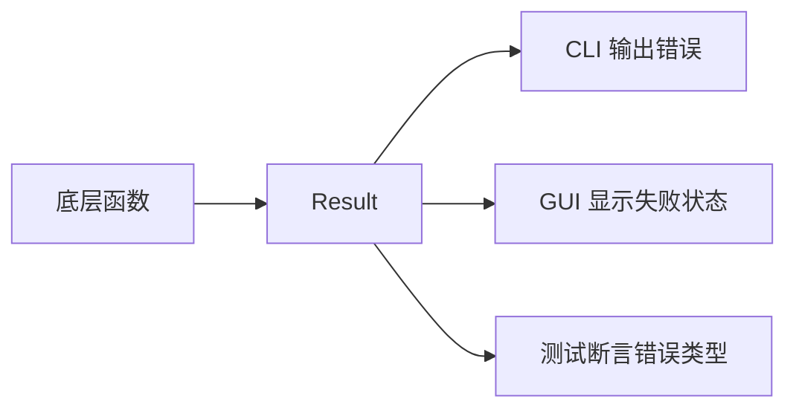

## 2. 先做 local-copy，而不是直接上网络

### 当时状态

项目还不能联网传输。

我们先实现了 `local-copy`，原因是：网络传输本质上也是读源文件、写目标文件、校验、提交结果。先在本地把这条链路跑通，后面网络只是把中间的字节流从内存/文件换成 socket。

### 开发流程

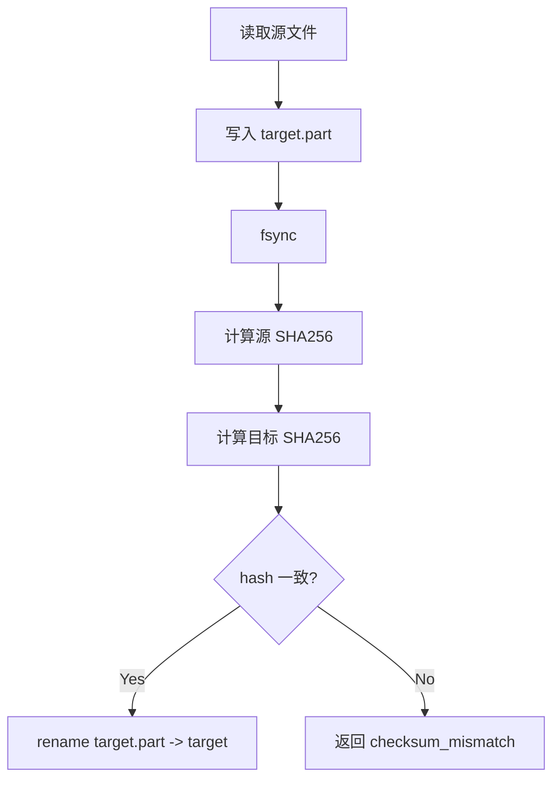

### 中间讨论和问题

#### fd 为什么要 RAII

我之前说“RAII 封装 fd，禁止复制，只能移动”，你误解成“文件不能复制”。

这里后来澄清了：不是文件不能复制，而是“文件描述符对象不能被复制”。

因为一个 fd 如果被两个对象同时拥有，就会出现：

- 一个对象析构 close 了 fd。
- 另一个对象还以为 fd 可用。
- 或者两个对象析构时 close 两次。

所以 fd 对象只能 move，语义是“所有权转移”。

#### hash 要不要自己写

你问过“自己实现简单 hash 怎么写”，后来决定直接用 OpenSSL SHA256。

原因：

- 自己写 hash 可以学习，但不适合作为文件完整性校验。
- SHA256 是成熟实现。
- 后面单文件传输和 `.part` 校验都能复用。

### 本阶段结果

我们得到了一套文件系统提交模型：

```text
写 .part -> 校验 -> rename
```

这个模型后来成为单文件接收和目录同步接收的共同基础。

## 3. TCP hello：先证明两端能说话

### 当时状态

本地文件能力有了，但 sender/receiver 之间还没有网络连接。

下一步不是直接发文件，而是先做最小 TCP hello：

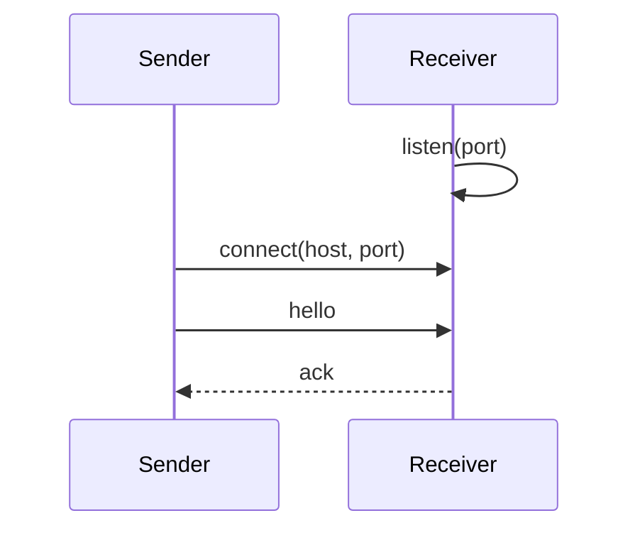

### 为什么这么做

TCP 传输问题可以分成两类：

- 连接层问题：能不能 connect/listen/accept？
- 协议层问题：连上后怎么分消息？

先做 hello，只解决第一类问题。

### 过程中解释过的点

你问过 `freeaddrinfo` 是干什么的。

当时我们在 TCP 代码里用了 `getaddrinfo` 查地址，系统会分配一组 `addrinfo` 链表。`freeaddrinfo` 就是释放这组地址结果，避免内存泄漏。

### 本阶段结果

能确认两端网络打通，但还不能传复杂消息。

这时也暴露出一个设计需求：裸 TCP 没有消息边界，不能直接靠 `read` 一次就认为读到一条完整消息。

于是进入下一阶段：frame 协议。

## 4. Frame 协议：解决 TCP 消息边界

### 触发问题

TCP 是字节流，不是消息队列。

如果直接：

```text
send("hello")
send("file_begin")
```

接收端可能读到：

```text
hellofile_begin
```

也可能只读到：

```text
hel
```

所以必须自己定义消息边界。

### 解决方案

定义统一 frame：

```text
magic + version + type + flags + body_size + body
```

流程变成：

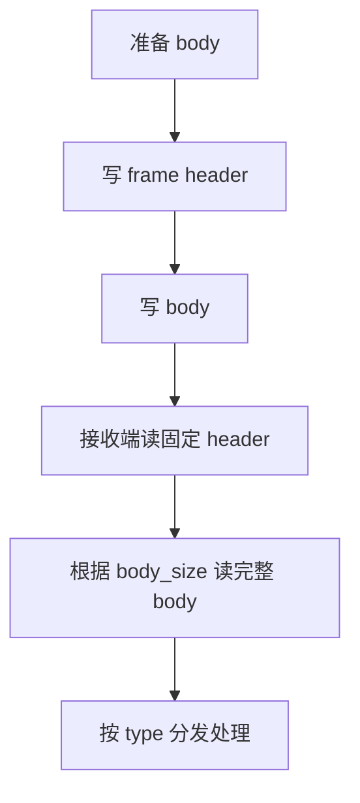

### 遇到的问题

#### frame 太大会怎么样

如果 body_size 不限制，恶意或错误数据可以让接收端分配巨大内存。

所以后来加了 frame body 最大限制。

#### hello 类型要不要版本化

最初 hello 可能只是：

```text
file
sync
```

后来改成：

```text
lan/1 file
lan/1 sync
```

同时保留旧格式兼容。

这是后面协议可演进的开始。

## 5. 单文件传输：第一条完整网络传输链路

### 当时目标

先不考虑文件夹，只把一个文件可靠传过去。

### 时序

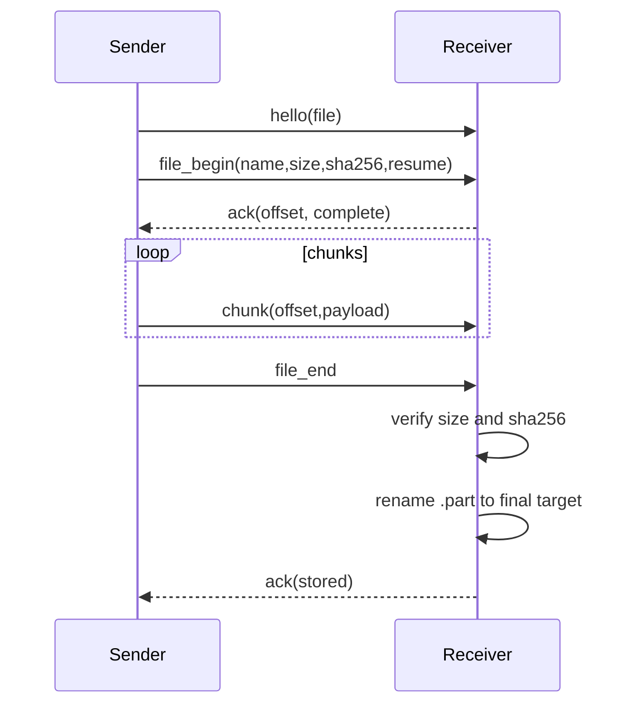

### 为什么要 file_begin

接收端需要提前知道：

- 文件名
- 文件大小
- SHA256
- 是否允许 resume

没有这些信息，接收端无法判断：

- 目标文件是不是已经存在？
- `.part` 能不能续传？
- 最后校验应该和哪个 hash 比？

### 为什么 chunk 要带 offset

最初发送 chunk 时，如果只发 payload，接收端只能默认“下一段数据一定按顺序到达”。

但协议应该能发现错误，而不是默默写坏文件。

所以 chunk body 设计为：

```text
offset + payload
```

接收端要求：

```text
chunk.offset == current_received_bytes
```

如果不相等，说明协议流错了，直接失败。

### 遇到的问题和修复

| 问题 | 根因 | 修复 |
| --- | --- | --- |
| 失败后留下半个最终文件 | 直接写 target 风险太高 | 接收端只写 `.part` |
| 无法断点续传 | 发送端不知道接收端已有多少 | 接收端 ack 返回 offset |
| 目标已有相同文件还重复传 | 没有 complete 语义 | ack 增加 `complete=1` |
| chunk 错位可能写坏文件 | payload 无位置校验 | chunk 增加 offset |

### 本阶段结果

单文件传输具备：

- SHA256 校验
- `.part`
- rename commit
- offset 校验
- 断点续传
- 跳过相同文件

这时 CLI 已经能完成比较可靠的点对点文件传输。

## 6. 从单文件到目录：为什么没有简单循环发送

### 当时的问题

用户需要传文件夹。

最直接的想法是：

```text
遍历目录 -> 每个文件调用一次单文件传输
```

但讨论后发现这不是一个好方向。

### 为什么不这么做

如果文件夹里有几千个小文件，每个文件都走一遍：

```text
hello -> file_begin -> chunks -> file_end
```

开销很高。

更重要的是，接收端无法提前判断：

- 哪些文件已经相同，可以跳过？
- 哪些文件可以做 delta？
- 哪些文件必须 full？

于是方向改成类似 rsync：

```text
先发清单 manifest
接收端根据本地状态生成 sync_plan
发送端按 plan 执行
```

### 新流程

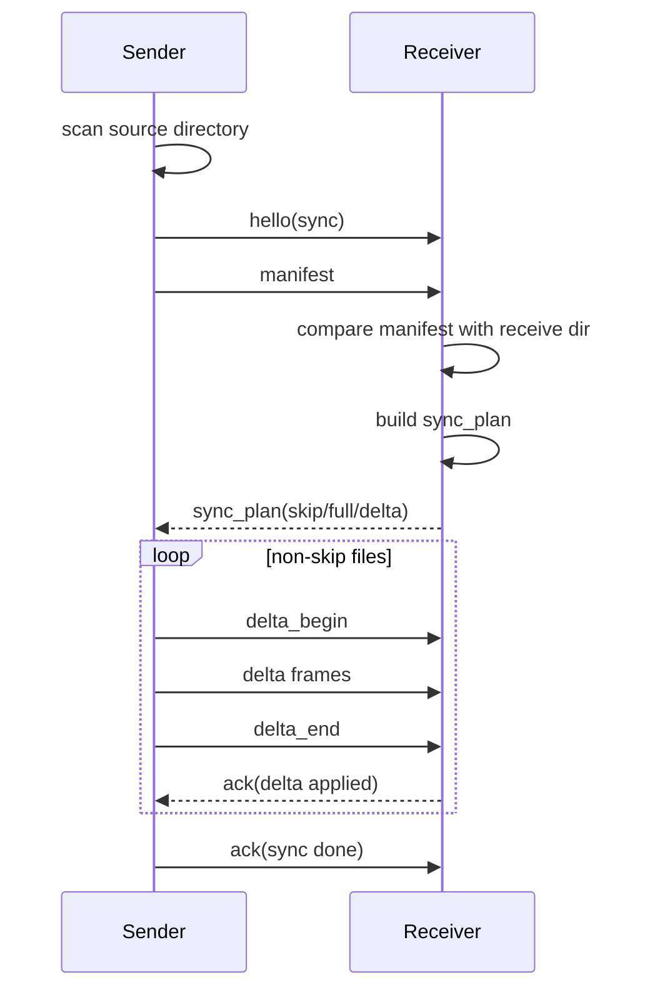

### manifest 最初记录什么

manifest 先记录文件级信息：

```text
relative_path
size
mtime
mode
sha256
```

后来因为大目录性能问题，目录扫描阶段默认不再预计算 SHA256。

### sync_plan 解决什么

sync_plan 是接收端给发送端的“执行计划”：

| action | 含义 |
| --- | --- |
| skip | 接收端认为文件已相同 |
| full | 接收端没有 basis，需要完整内容 |
| delta | 接收端有旧文件，可以尝试增量 |

### 本阶段留下的设计

目录同步不再是多个单文件传输的拼接，而是独立协议：

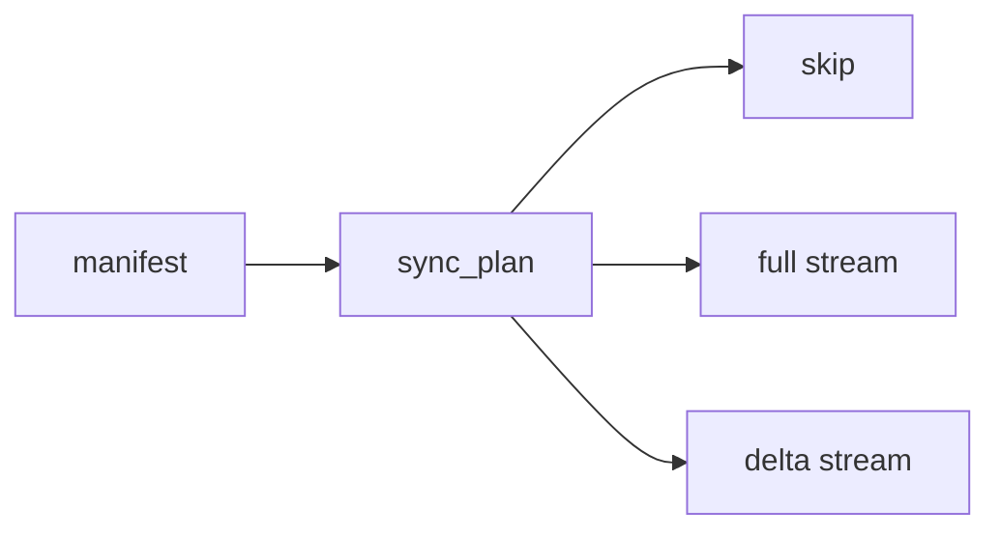

这就是后来 `single_file.cpp` 和 `sync_session.cpp` 分开的原因。

## 7. Delta：从完整计划到流式 rolling checksum

### 当时状态

目录同步已经能判断 full/delta。

delta 的目标是：如果接收端已有旧文件，发送端只发送差异。

### 基本思路

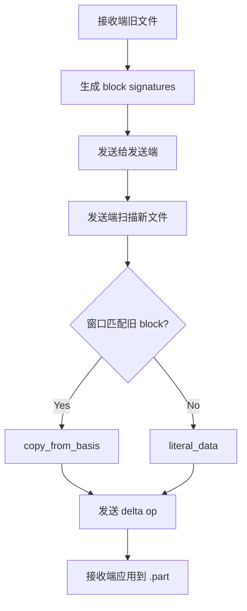

### 关键变化

一开始可以先构造完整 `DeltaPlan`：

```text
vector<DeltaOp>
```

但大文件时，完整 op 列表会占内存，而且发送端要等 plan 全部生成完才能开始发。

于是改成：

```text
扫描 source -> 生成一个 op -> 立即发一个 delta frame
```

这导致协议也要变：

早期：

```text
delta_begin(op_count)
delta...
```

问题是 op_count 要提前知道。

后来：

```text
delta_begin(source metadata)
delta...
delta_end(op_count)
```

op_count 放到最后，就支持流式生成。

### 解决的问题

| 问题 | 解决 |
| --- | --- |
| 大文件 delta plan 内存大 | delta op 流式生成 |
| 发送端开始发送太晚 | 生成一个 op 就发一个 |
| 接收端仍需要完整性判断 | `delta_end` 带最终 op_count |

## 8. 网络适配层：为以后替换网络库留出口

### 当时讨论

你问过如果用 standalone Asio 会怎么样。

当时判断是：现在不急着换，因为当前 POSIX socket 已经能跑；但如果继续把 socket 调用写进 transfer 层，后面要换 Asio/QtNetwork 会很痛。

所以先抽象网络层。

### 形成的接口

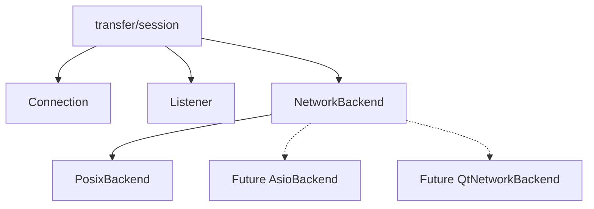

### 这个决定带来的好处

后面测试里可以做 memory connection，不需要每个测试都开真实端口。

也让 GUI/app 层可以注入 backend。

这一步不是用户可见功能，但它让后面快速补测试成为可能。

## 9. 测试：从手工跑 CLI 到 memory connection

### 当时状态

前期主要靠命令行手工验证：

```sh
./receiver ...
./sender ...
```

但目录同步、delta、取消、错误路径越来越复杂，靠手工很难防回归。

### 引入测试后的结构

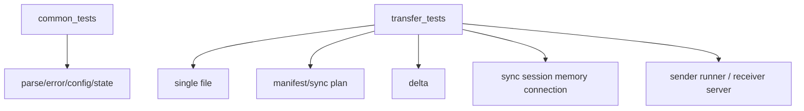

### 一个典型测试救回归的例子

后面修“发送文件夹不保留顶层目录”时，第一次只改了接收端 build_sync_plan 的根目录。

测试马上暴露：

```text
delta: receiver error: failed to open delta basis
```

原因是：

```text
sync_plan 用了 receive_dir/root_name
但 apply_delta_stream_to_target 仍然写 receive_dir
```

最后统一改成：

```text
plan.receive_root
```

这个问题如果没有 memory connection 测试，只靠 GUI 手测会很难定位。

## 10. 传输事件：为了 GUI 不直接依赖传输细节

### 当时状态

CLI 已经可以打印进度，但 GUI 需要一个统一状态模型。

如果 GUI 直接读 sender/receiver 内部变量，后面会非常混乱：

- 单文件和目录状态不同。
- 发送和接收状态不同。
- 失败、取消、完成都要显示。
- 多任务需要按 id 区分。

### 解决方式

引入事件：

```text
TransferStarted
TransferProgress
TransferCompleted
TransferFailed
TransferCancelled
```

事件进入 `TransferSnapshotStore`，变成 GUI 可展示的快照。

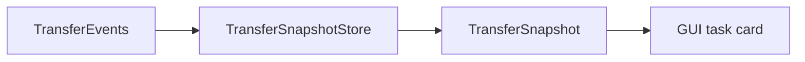

### 状态流转

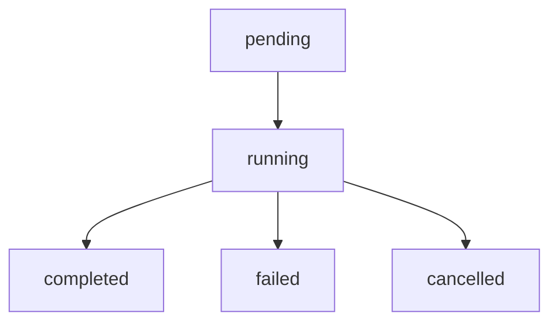

### 后续收益

后面增加：

- 打开接收目录
- 停止按钮
- 清除列表
- 失败状态
- 接收端进度

都可以通过事件和 snapshot 扩展，而不是 GUI 自己拼状态。

## 11. GUI 第一版：能用，但体验不对

### 当时状态

CLI 能发文件和目录后，开始做 Qt GUI。

第一版 GUI 主要是把功能连起来：

- 选择接收目录。
- 发现机器。
- 连接机器。
- 拖拽发送。
- 显示任务列表。

### 你提出的问题

GUI 初版之后，你连续指出了几个体验问题：

1. 页面太复杂，不需要多余操作。
2. 启动只需要确定接收目录。
3. 列表区域和拖拽区域不要分开。
4. 卡片太丑，要表格式布局。
5. 按钮状态不对。
6. 400x600 更合适。
7. 按钮必须水平排列，不能挤没。

### 调整后的 GUI 方向

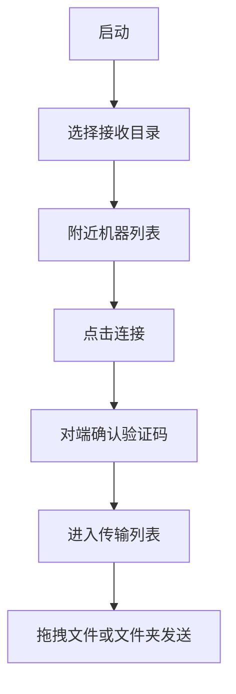

这个过程里，GUI 从“功能堆叠”变成了“按用户实际流程组织”。

## 12. 发现、连接确认和 connection refused

### 当时状态

GUI 能发现机器，但你指出：

1. 两个设备互相发现连接没有权限认证。
2. 一个设备发起连接后，另一个设备链接状态应该同步改变。

于是增加：

- UDP discovery
- link_request
- link_accept
- link_reject
- 验证码确认

### 连接流程

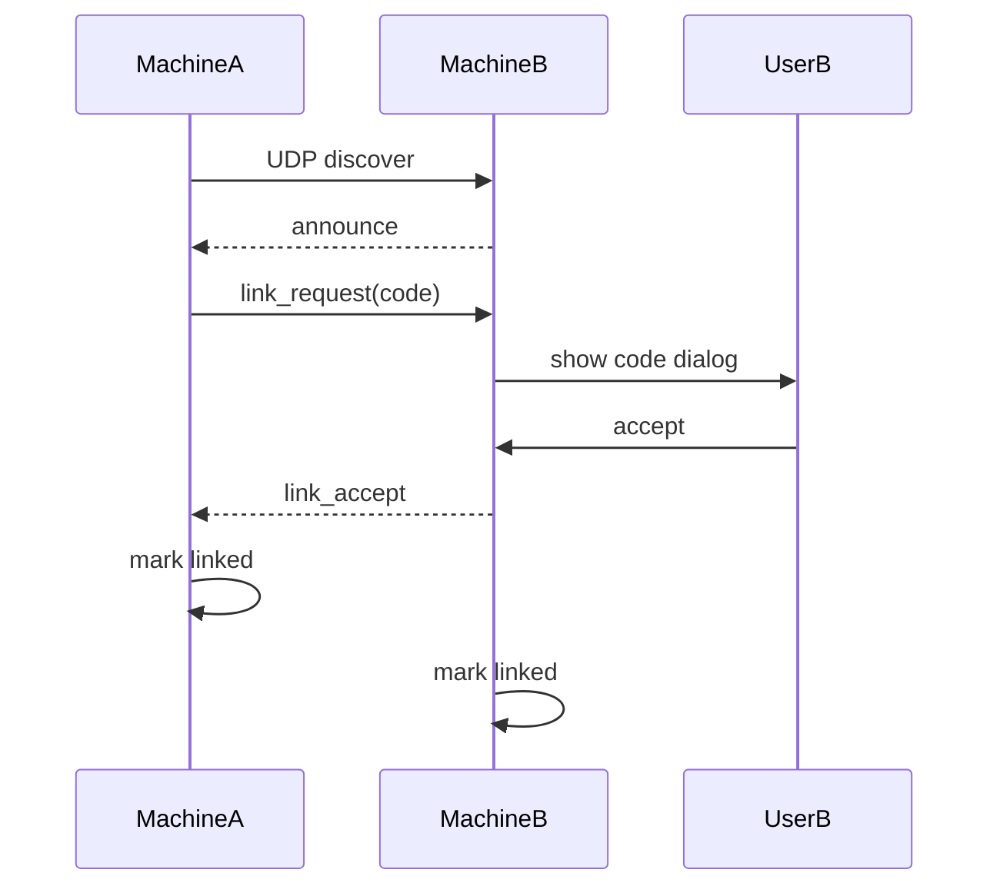

### 后来遇到 connection refused

你贴过日志：

```text
Starting send ... -> 10.8.12.139:39123
failed to connect TCP socket: 拒绝连接
```

你在服务端机器跑：

```sh
ss -lntp | grep 39123
```

发现没有监听。

### 根因

GUI 的 discovery 状态和 receiver TCP listening 状态没有严格绑定。

也就是：

```text
对端看到了这台机器
但这台机器 TCP receiver 还没真的监听
```

### 修复

- 增加 GUI 诊断日志。
- receiver 启动后确认 listening。
- discovery/link 受 receiver readiness 控制。

### 经验

真实网络问题不要猜，先加日志。

这个问题之后，GUI 日志成为两机测试的重要工具。

## 13. 打包、翻译、托盘

### 当时状态

GUI 能跑后，开始补桌面应用形态。

做了：

- `.desktop`
- SVG 图标
- Qt 翻译 `.ts` / `.qm`
- CPack Debian 包
- `scripts/package_deb.sh`
- 托盘隐藏运行

### 遇到的问题：翻译文件存在但不生效

你贴过 deb 内容，里面确实有：

```text
/usr/share/lan-file-transfer/translations/lan-file-transfer_zh_CN.qm
```

但界面仍是英文。

### 根因

打包进去不等于程序运行时能找到。

Qt 需要程序主动从正确路径加载 `.qm`。

### 修复

- 修正运行时 translation search path。
- 打包脚本确保 `.qm` 安装到固定目录。

### 打包流程沉淀

后来加了：

```sh
scripts/package_deb.sh
```

避免每次手敲多条 CMake/CPack 命令。

## 14. 大目录性能问题：看起来像卡住

### 触发场景

你拖入一个大概 1.9G 的文件夹，里面很多歌曲。

现象是：

```text
显示开始传输
但速率和进度没有变化
日志也没有更新
```

### 排查思路

这个现象可能卡在多个阶段：

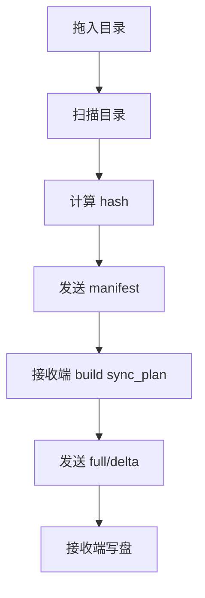

当时问题是：日志不够细，所以用户不知道卡在哪。

### 根因 1：manifest 阶段预 hash 太慢

目录里文件很多时，如果每个文件都算 SHA256，会在真正传输前等待很久。

### 修复 1

目录同步扫描阶段不再预计算 SHA256。

改为：

```text
size + mtime quick-check
```

这牺牲了一点严格性，但换来了交互响应。

严格校验以后可以做成模式：

- fast
- normal
- strict

### 根因 2：进度不够细

接收端原来只知道目录处理了几个文件，不知道当前文件写了多少。

### 修复 2

增加：

```text
current_file
current_action
current_file_bytes
current_file_total_bytes
current_file_ops
```

接收端每应用一个 delta op 就发布进度。

### 结果

大目录场景下，至少能知道：

- 正在扫描。
- 扫描了多少文件/字节。
- 正在发送哪个文件。
- 接收端正在应用哪个文件。
- 当前文件写了多少。

## 15. 停止任务和清除列表分离

### 触发问题

你指出：

> 列表正在扫描，我停止任务，任务停止不了；关闭任务只是清除卡片列表。我觉得清除任务和清除列表要分开。

### 当时状态

UI 上“停止”和“清除”语义不够清楚。

更底层的问题是：取消信号只是一个 flag，如果线程阻塞在 socket read/write，它不会立刻醒。

### 修复

1. UI 分离：
   - stop：停止正在进行的任务。
   - clear：只清除已经结束的任务记录。

2. sender runner 记录 active connection。

3. cancel 时：

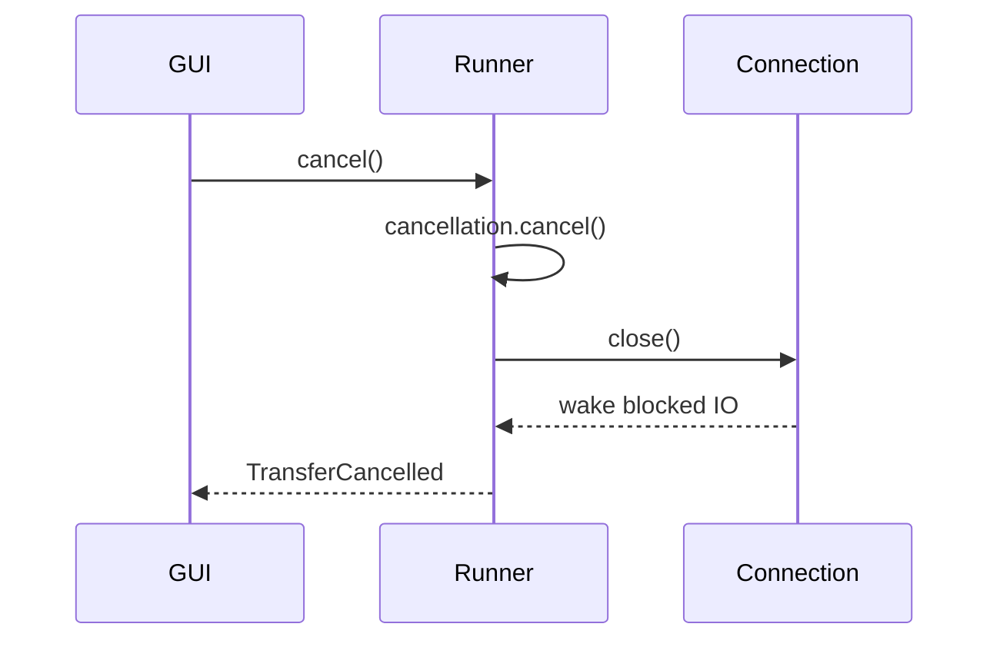

### 结果

取消不再只是“设置状态”，而是会关闭当前连接，让阻塞 IO 返回。

## 16. 文件夹顶层目录丢失 bug

### 触发问题

你发现：

> 我传输文件夹，他并没有把文件夹传过去，只把文件夹里面的文件传过去。

### 当时表现

发送：

```text
Music/
  a.mp3
  cover.jpg
```

接收结果：

```text
receive_dir/a.mp3
receive_dir/cover.jpg
```

期望结果：

```text
receive_dir/Music/a.mp3
receive_dir/Music/cover.jpg
```

### 定位过程

看 manifest 生成逻辑：

```text
relative_path = relative(file, root)
```

所以 `Music/a.mp3` 在 manifest 里是：

```text
a.mp3
```

接收端当时写入：

```text
receive_dir / relative_path
```

于是顶层目录天然丢失。

### 第一次修复思路

给 manifest 增加：

```text
root_name
```

接收端使用：

```text
receive_root = receive_dir / root_name
```

### 测试暴露的新问题

第一次改完后测试失败：

```text
delta: receiver error: failed to open delta basis
```

原因是只改了 `build_sync_plan` 的 receive root，但实际 apply delta 时仍然传 `config.receive_dir`。

也就是说：

```text
规划阶段看 receive_dir/Music
写入阶段写 receive_dir
```

### 最终修复

统一使用：

```text
plan.receive_root
```

同时：

- manifest codec 增加 v2 magic + root_name。
- `ReceiveSyncReport` 增加 `target_root`。
- GUI 的“打开目录”指向真实接收目录。
- 测试断言 `receive_dir/Music/new.txt` 存在。
- 测试断言 `receive_dir/new.txt` 不存在。

### 经验

路径语义必须在 transfer/protocol 层解决，不能只在 GUI 层补。

因为 CLI、GUI、测试、未来 API 都应该共享同一套语义。

## 17. 当前稳定版本形态

现在的主流程可以概括为：

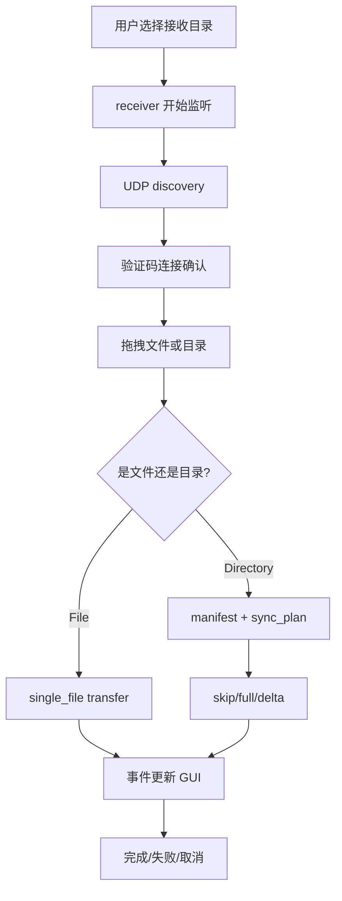

当前已经解决的问题：

- TCP 消息边界。
- 单文件可靠传输。
- `.part` 临时文件。
- SHA256 校验。
- 断点续传。
- 跳过相同文件。
- 目录 manifest。
- sync plan。
- rolling delta。
- full/delta 流式发送。
- 大目录不预 hash。
- 接收端细粒度进度。
- 取消时关闭 active connection。
- GUI 发现、连接确认、日志。
- deb 打包、图标、翻译、托盘。
- 发送文件夹保留顶层目录。

## 18. 还没解决但已经明确方向的问题

这些不是一开始忘了做，而是根据当前阶段有意延后：

| 问题 | 为什么延后 | 后续方向 |
| --- | --- | --- |
| 空目录同步 | 当前 manifest 还是文件列表 | manifest tree upgrade |
| 目录总字节进度和 ETA | 需要 manifest 汇总 total bytes | progress accounting |
| 更严格校验 | 大目录预 hash 会影响体验 | verification modes |
| 网络超时/心跳 | 当前先保证基本连接和取消 | timeout + heartbeat |
| 持久化断点续传 | 需要 session id 和 checkpoint | persistent resume |
| 小文件批处理 | 需要稳定 manifest tree | batch metadata/ack |
| 更复杂的任务拓扑 | 基础队列已经完成，还需要继续增强策略 | priority/retry/persistent queue |

## 19. 回溯后的经验

这条开发路线里最重要的经验是：

1. 不要一开始就写 GUI，先把 CLI 和协议闭环跑通。
2. 不要一开始就写目录同步，先把单文件传可靠。
3. 不要靠猜修真实网络问题，先加日志。
4. 目录同步不要简单复用单文件循环，否则后面 delta、skip、进度都会难做。
5. 大目录不能预先做太重的工作，否则用户会以为卡死。
6. 取消任务不能只改状态，要打断阻塞 IO。
7. 协议字段一旦变化，必须补测试和文档。
8. 路径语义属于传输层，不属于 GUI。
9. 每次 bug 修复都应该留下一个能复现它的测试。

## 20. 多设备队列后的架构整理

多设备互联、设备切换、任务排队做完之后，`MainWindow` 开始明显变重。
当时主窗口同时承担了这些职责：

- 构建设备列表 UI。
- 维护 peer map、在线状态、已连接状态、当前活动设备。
- 维护发送目标集合。
- 编码和解析 UDP discovery/link JSON。
- 保存传输 snapshot。
- 判断任务属于哪个设备页。
- 构建发送目标和更换目标弹窗。
- 调用 scheduler 启动、暂停、移动、取消任务。

这会带来一个维护风险：后面继续做多设备拓扑、重试、优先级、持久化队列时，很容易在 UI 事件回调里继续堆业务状态。
因此本轮先做了一次小步拆分，而不是一次性重写 GUI。

### 拆分后的结构

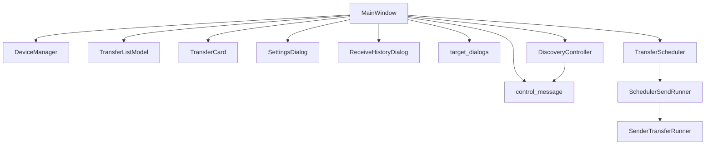

各模块职责：

| 模块 | 负责什么 | 不负责什么 |
| --- | --- | --- |
| `MainWindow` | 页面切换、按钮回调、控件刷新、日志显示 | 不直接保存复杂设备/任务拓扑 |
| `DeviceManager` | peer 列表、在线过期、连接状态、活动设备、发送目标 | 不发 UDP、不弹窗 |
| `DiscoveryController` | UDP socket、broadcast/extended probe、announce、control send、datagram decode | 不决定是否接受连接 |
| `TransferListModel` | transfer snapshot、任务所属设备、按设备过滤、隐藏任务 | 不创建 QWidget |
| `TransferCard` | 单个传输项的布局、指标、状态和操作按钮 | 不读取 scheduler/model |
| `SettingsDialog` | 接收目录、关闭行为、并发设置表单 | 不保存设置、不重启 receiver |
| `ReceiveHistoryDialog` | 接收历史列表和用户动作 | 不读写 QSettings、不打开文件管理器 |
| `control_message` | UDP 控制消息 JSON encode/decode | 不处理消息语义 |
| `target_dialogs` | 选择发送目标、移动排队任务目标 | 不调用 scheduler |
| `TransferScheduler` | 任务队列、并发上限、设备在线/离线调度 | 不关心 GUI 页面 |

### 为什么这样拆

本轮的目标不是“为了好看而拆文件”，而是为了后续几类复杂功能留出边界：

1. 多设备同时连接后，设备状态必须是一个独立模型，否则活动设备、发送目标、在线状态会互相污染。
2. 每个设备有自己的传输列表视图，传输 snapshot 必须能按 peer 过滤。
3. UDP 控制消息后续可能加 capability、签名或协议版本，不能散落在主窗口里手写 JSON。
4. 调度器要测试并发、慢网络、失败、取消，不能每个测试都真的启动 TCP 发送。

### 新增测试

新增了调度器 fake runner 注入能力：

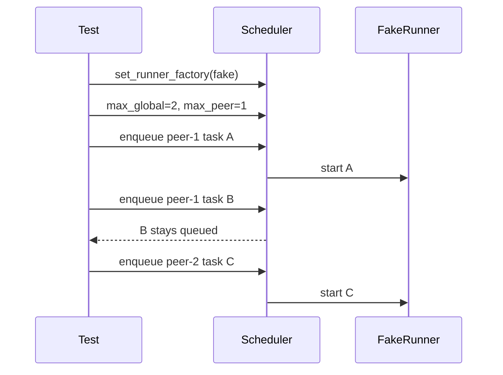

验证点：

- 全局最多同时运行 2 个发送任务。
- 同一设备最多运行 1 个发送任务。
- peer-1 的第二个任务不会抢占或越过单设备上限。
- 释放 fake runner 后，队列里的任务可以继续被 `pump()` 启动。

### 本轮提交顺序

1. `refactor: extract target selection dialogs`
2. `refactor: extract device state manager`
3. `refactor: extract gui control message codec`
4. `refactor: extract transfer list model`
5. `test: inject scheduler send runner`

这次整理之后，后续继续优化时建议遵守一个原则：

> 如果逻辑可以脱离 Qt 控件独立描述，就优先放进小模型或核心类；`MainWindow` 只做组装和表现层。
